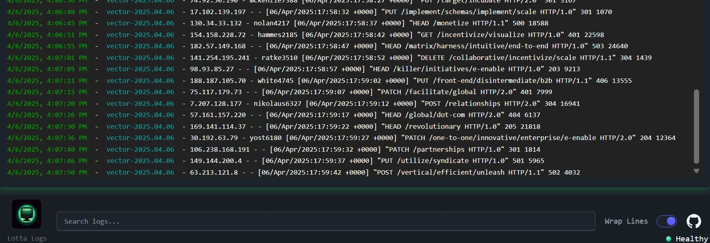

# LottaLogs

App to view aggregated logs quickly without using k9s or equivalent. I wanted something
with the simplicity of something like [Papertrail](https://www.papertrail.com/) but was unable to find it.
Screenshot of functionality visible below:



To get started, run `make` to view help.

## Quickstart 

Requires `cargo-watch` [cargo-watch](https://crates.io/crates/cargo-watch) to be installed.

### Install Dependencies
To install all necessary dependencies, run:
```bash
make install
```

### Start the Application
To start the application and its dependencies, run:
```bash
# start the backend
make start
# start the frontend
make start-frontend
```

You should really only have to operate out of the frontend.

### Run Tests
To execute the test suite, run:
```bash
make test
```

### Format Code
To format the codebase, run:
```bash
make format
```

#### Logo

Logo and content generated by OpenAI with ChatGPT. As of 04/05/2025 when this was generated on their [Terms of Service](https://openai.com/policies/row-terms-of-use/):

> Ownership of content. As between you and OpenAI, and to the extent permitted by applicable law, 
> you (a) retain your ownership rights in Input and (b) own the Output. We hereby assign to you 
> all our right, title, and interest, if any, in and to Output.
